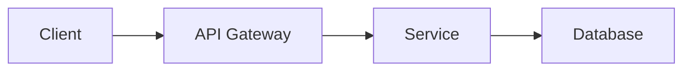

# Spec: [SPEC-XXX] Title

> **Status:** Draft | In Review | Approved | Implementing | Done  
> **Author:** [Architect Name]  
> **Created:** YYYY-MM-DD  
> **Last Updated:** YYYY-MM-DD  
> **Epic/Feature:** [Link to parent feature or epic]  
> **Priority:** P0 | P1 | P2 | P3  

---

## 1. Summary

_One paragraph describing what this spec delivers and why it matters. Write this as if explaining to a TPM who needs to understand the business value._

## 2. Background & Motivation

_Why are we doing this? What problem does it solve? Link to relevant ADRs, prior specs, or product requirements._

## 3. Requirements

### 3.1 Functional Requirements

_What the system must do. Be explicit — these become acceptance criteria and AI prompts._

- **FR-1:** [Requirement description]
- **FR-2:** [Requirement description]
- **FR-3:** [Requirement description]

### 3.2 Non-Functional Requirements

_Performance, security, scalability, observability, etc._

- **NFR-1:** [e.g., API response time < 200ms at p95]
- **NFR-2:** [e.g., All endpoints require authentication]
- **NFR-3:** [e.g., Structured logging for all operations]

## 4. System Design

### 4.1 Architecture Overview

_High-level description of how this fits into the existing system. Include a diagram if helpful (Mermaid, PlantUML, or image link)._



### 4.2 API Contract

_Define endpoints, request/response shapes, error codes. Use OpenAPI format or structured tables._

**Endpoint:** `POST /api/v1/resource`

| Field | Type | Required | Description |
|-------|------|----------|-------------|
| `name` | string | Yes | Display name |
| `type` | enum | Yes | One of: `A`, `B`, `C` |
| `metadata` | object | No | Additional key-value pairs |

**Response (200):**
```json
{
  "id": "string",
  "name": "string",
  "created_at": "ISO-8601"
}
```

**Error Codes:**
| Code | Meaning |
|------|---------|
| 400 | Invalid request body |
| 401 | Unauthorized |
| 409 | Resource already exists |

### 4.3 Data Model

_Define new or modified database schemas, relationships, indexes._

### 4.4 Key Design Decisions

_Explain non-obvious choices. Link to ADRs where applicable._

## 5. Acceptance Criteria

_These are the conditions that must be true for this spec to be considered "done." Write them as testable statements. These will be used by senior developers to validate AI-generated code._

- [ ] **AC-1:** [Given X, when Y, then Z]
- [ ] **AC-2:** [Given X, when Y, then Z]
- [ ] **AC-3:** [Given X, when Y, then Z]
- [ ] **AC-4:** All endpoints return appropriate error codes per the API contract
- [ ] **AC-5:** Test coverage ≥ 80% for new code
- [ ] **AC-6:** No critical or high-severity security findings

## 6. AI Implementation Notes

_Guidance specifically for the senior developer who will use Claude Code to implement this spec. Include hints, gotchas, and suggested decomposition._

### 6.1 Suggested Agent Task Breakdown

_How should this spec be broken into agent-sized tasks?_

1. **Task 1:** [e.g., Generate data model and migrations]
2. **Task 2:** [e.g., Implement core service logic]
3. **Task 3:** [e.g., Build API endpoints with validation]
4. **Task 4:** [e.g., Write test suite]

### 6.2 Prompt Guidance

_Any specific instructions or context the agent will need._

- Reference existing patterns in `src/services/example-service.ts`
- Use the shared validation library at `src/lib/validators`
- Follow error handling pattern established in ADR-005

### 6.3 Known Complexity / Watch Areas

_Where might the AI struggle? What needs extra human review?_

## 7. Dependencies

| Dependency | Type | Owner | Status |
|-----------|------|-------|--------|
| [Spec or system] | Blocks / Blocked by | [Team] | [Status] |

## 8. Rollout Plan

_How will this be deployed? Feature flags? Phased rollout? Migration steps?_

## 9. Open Questions

_Unresolved items that need input before implementation begins._

- [ ] **Q1:** [Question — assigned to @person]
- [ ] **Q2:** [Question — assigned to @person]

---

## Changelog

| Date | Author | Change |
|------|--------|--------|
| YYYY-MM-DD | [Name] | Initial draft |
